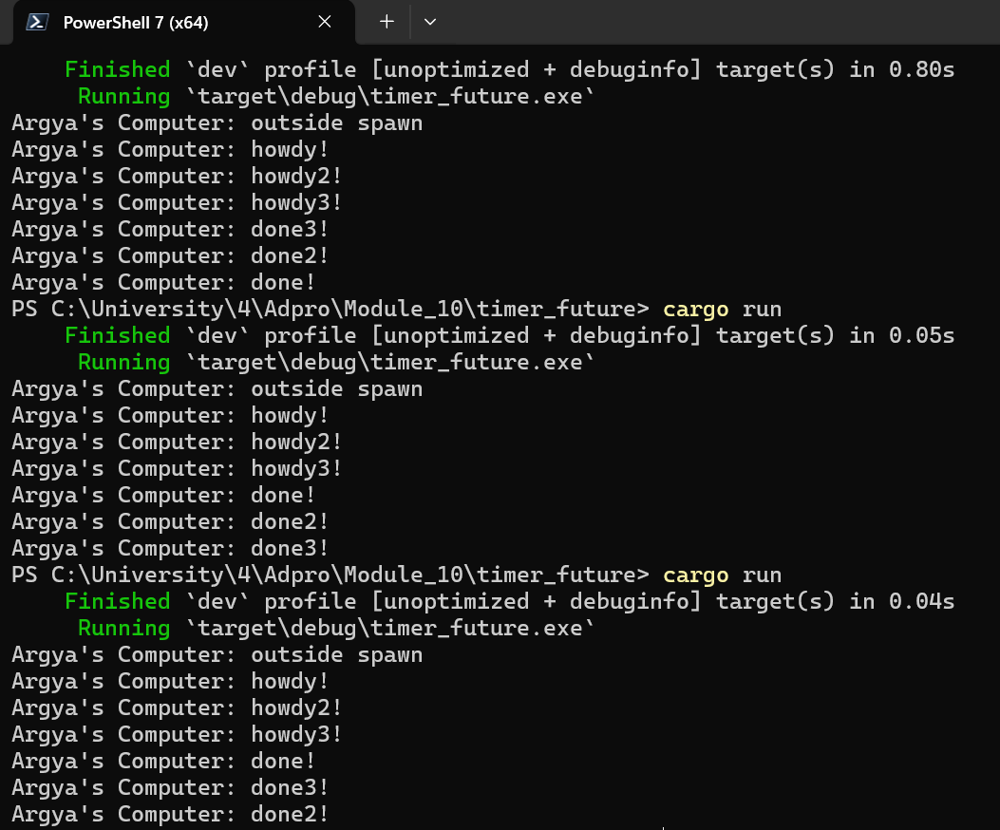
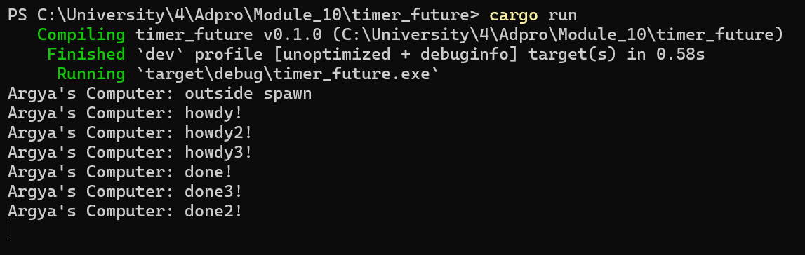

# Module 10 - Timer

## Message outside of Spawn

Looking at my screenshot, the output of the main function shows:

1. "Argya's Computer: outside spawn"
2. "Argya's Computer: howdy!"
3. "Argya's Computer: done!"

This execution order occurs because of how async Rust works. In my code, `spawner.spawn()` adds the async task to the executor's queue but doesn't run it immediately. The "outside spawn" message prints first because it's in the main synchronous flow. Then when `executor.run()` is called, it starts processing the queue and executes the async block, printing "howdy!". The `TimerFuture::new(Duration::new(2, 0)).await` causes the task to yield for 2 seconds, after which execution resumes and "done!" is printed. This demonstrates the non-blocking nature of async code, the task is suspended during the timer wait without blocking the thread.

## Multiple Spawns with drop

In this modified code, i added 2 new spawn in the main function. Below is the explanation why the output is like the above:

**Common pattern in all runs:**
1. "outside spawn" always appears first after compilation
2. "howdy!", "howdy2!", "howdy3!" always appear in sequence in that exact order

**Completion messages ("done" statements) across runs:**
- Run 1: "done3!", "done2!", "done!" (reverse order)
- Run 2: "done!", "done2!", "done3!" (same order as spawning)
- Run 3: "done!", "done3!", "done2!" (mixed order)

This consistent behavior with "howdy" messages but inconsistent behavior with "done" messages reveals key aspects of the executor:

1. The initial execution order is deterministic - the executor processes tasks in the exact order they were spawned, which is why "howdy" messages always appear in the same order (1,2,3).

2. However, when the tasks are suspended (during `await`), they each wait for 2 seconds independently. When they complete, they're re-queued for execution, but the order of re-queuing depends on subtle timing differences.

3. The executor simply processes tasks from its queue in the order they arrive. Since all three timers complete at approximately the same time (2 seconds), tiny differences in system timing and wake-up handling lead to different re-queuing orders each time the program runs.

This demonstrates a fundamental principle of asynchronous programming: while the initial execution order of tasks can be predicted, the completion order cannot be guaranteed without explicit synchronization when tasks have similar completion times.

## Multiple Spawns without drop

When i removed `drop(spawner)`, the primary change is that the `Spawner` object remains alive throughout program execution instead of being explicitly dropped. This has several implications:

1. **Program Termination Behavior**: 
   - With `drop(spawner)`: The executor knows it will never receive new tasks once the spawner is dropped, so it can exit its run loop when all current tasks are completed
   - Without `drop(spawner)`: The executor has no way to know if more tasks might be spawned in the future, so technically it could wait indefinitely for new tasks

2. **Channel Lifecycle**:
   - The `sync_channel` used for task communication remains open as long as there's at least one sender (`Spawner`) in existence
   - When all senders are dropped, the channel is automatically closed, which signals to the receiver (`Executor`) that no more messages will arrive

3. **What Didn't Change**:
   - The execution order of the tasks
   - The fundamental behavior of the async system
   - The output pattern (the "howdy" messages in sequence, followed by "done" messages in varying order)

In conclusion, without the drop, the program kept running eventhough the main function has finished printing all the output and the executor stills waits for any new spawned in the future.
