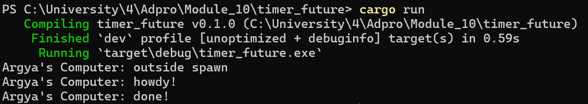

# Module 10 - Timer

Looking at my screenshot, the output of the main function shows:

1. "Argya's Computer: outside spawn"
2. "Argya's Computer: howdy!"
3. "Argya's Computer: done!"

This execution order occurs because of how async Rust works. In my code, `spawner.spawn()` adds the async task to the executor's queue but doesn't run it immediately. The "outside spawn" message prints first because it's in the main synchronous flow. Then when `executor.run()` is called, it starts processing the queue and executes the async block, printing "howdy!". The `TimerFuture::new(Duration::new(2, 0)).await` causes the task to yield for 2 seconds, after which execution resumes and "done!" is printed. This demonstrates the non-blocking nature of async code, the task is suspended during the timer wait without blocking the thread.